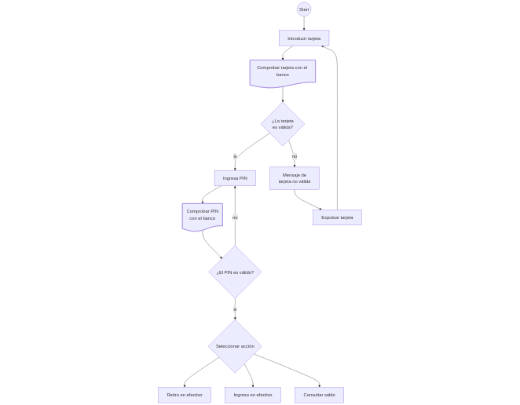

```mermaid
flowchart TD
    start((Start))
    introducir_tarjeta[Introducir tarjeta] 
    comprobar_tarjeta@{ shape: doc, label: "Comprobar tarjeta con el banco" }
    tarjeta_valida{"¿La tarjeta 
    es válida?"}

    start --> introducir_tarjeta --- comprobar_tarjeta --- tarjeta_valida
    tarjeta_valida -- si --> ingresa_pin["Ingresa PIN"]
    tarjeta_valida -- no --> error_msg["Mensaje de 
    tarjeta no válida"] --> exit0["Expulsar tarjeta"] --> introducir_tarjeta

    comprobar_pin@{ shape: doc, label: "Comprobar PIN 
    con el banco" }
    pin_valido{"¿El PIN es válido?"}
    
    ingresa_pin --> comprobar_pin --> pin_valido -- no --> ingresa_pin
    pin_valido -- si --> seleccionar_accion{"Seleccionar acción"}
    accion0["Retiro en efectivo"]
    accion1["Ingreso en efectivo"]
    accion2["Consultar saldo"]

    seleccionar_accion --> accion0
    seleccionar_accion --> accion1
    seleccionar_accion --> accion2
    ```
